# 明日方舟一图流：礼包编辑器

本项目以 Django 写成，主要有两个作用：

1. 提供包含登录功能的 Web 面板，以便编辑礼包的内容；
2. 提供与原先一致的数据接口，供前端调用。

## 运行方式

目前还没有做好兼顾开发环境与生产部署。以下仅介绍在生产环境下如何部署。

项目可以使用 Docker 运行，可以指定 `--entrypoint /bin/bash` 以进入交互式的 shell，完成准备工作。

```bash
# 1. 安装依赖
python3 -m venv venv
source venv/bin/activate
pip install -r requirements.txt

# 2. 生成静态文件
./manage.py collectstatic

# 3. 使用 Web 服务器托管生成的静态资源

# 4. 创建数据库
./manage.py migrate

# 5. 建立管理员账号
./manage.py createsuperuser

# 6. 运行服务
gunicorn pack_editor.wsgi -b 0.0.0.0:9000

# 7. 配置 Web 服务器，通过反代提供服务
```

## 词汇表

- Originium: 源石
- Orundum: 合成玉

## 数据库设计

礼包的内容分为四类：养成材料（龙门币、芯片、经验书等）、抽卡资源（合成玉、单抽券、十连券）、既能换理智刷材料，又能换合成玉抽卡的源石，和皮肤、家具等其它内容。

把源石作为礼包的属性，其余三类物品各建一张表。

养成资源的价值以等效理智计（如 1 龙门币对应的理智为 36 / 10000 = 0.0036；一支应急理智加强剂对应的理智为 80），抽卡资源的价值以合成玉计（合成玉是 1，单抽是 600，十连就是 6000），其它资源的价值以源石计。

物品与礼包之间是多对多的关系，所以各有一张中间表。在中间表里，记录礼包包含该物品的数量。

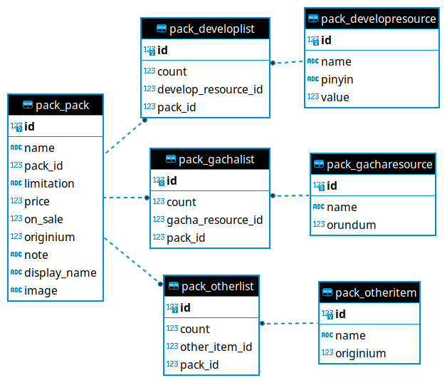

各字段的含义记录在 `help_text` 中，前往 [models.py](./pack/models.py) 查看。

## 接口

接口的格式与文档请看 [BackEndAPI.md](https://github.com/Arknights-yituliu/frontend-v3/blob/main/docs/BackEndAPI.md#%E8%8E%B7%E5%8F%96%E5%95%86%E5%BA%97%E7%A4%BC%E5%8C%85%E6%80%A7%E4%BB%B7%E6%AF%94jsonarray)。

实现这部分功能的代码在 [api.py](./pack/api.py)，使用了 [Django Ninja](https://django-ninja.rest-framework.com/)。ContentSchema、PackSchema 与 ResponseSchema 为框架所需。

在 list_packs 函数中进行了一些简单的计算。

## 管理面板

Django 自带账号系统与管理面板。在 [admin.py](./pack/admin.py) 中进行了定制。

管理面板位于 `/develop/create/`。登录后进入以下页面：

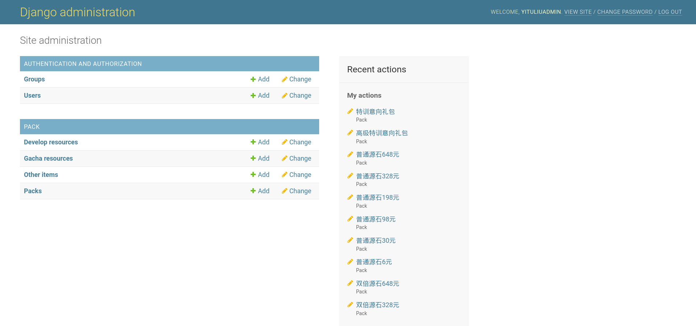

以下简要介绍面板的使用方法，并说明相应的功能是如何实现的。

### 账号相关

点击左侧 Users，进入用户列表页面。

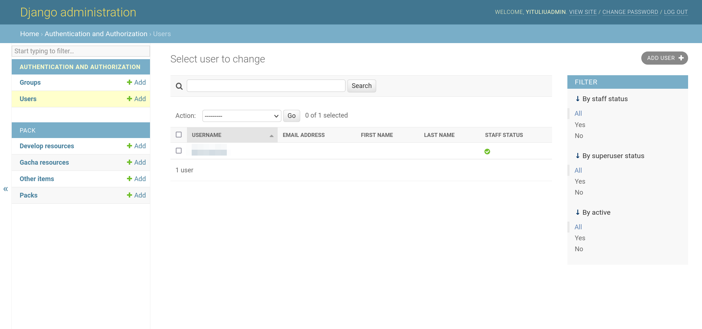

点击用户名，可以修改用户的详细信息，包括用户名等。

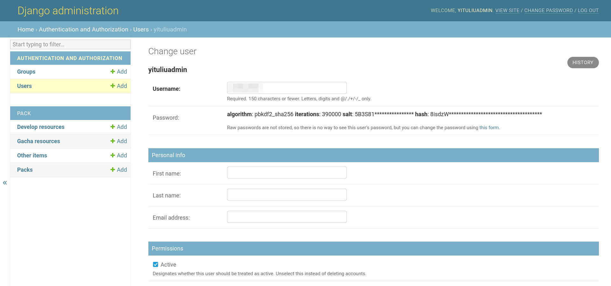

若要修改用户的密码，点击 this form 链接即可。

以上均为 Django Admin 自带功能，并无修改。

### 礼包相关

在面板首页，PACK 下共有四条链接：

- Develop resources：养成材料
- Gacha resources：抽卡资源
- Other items：其它内容
- Packs：礼包

与这部分功能对应的代码在 [admin.py](./pack/admin.py) 中。

#### Gacha resources

点击 Gacha resources，进入养成资源列表。

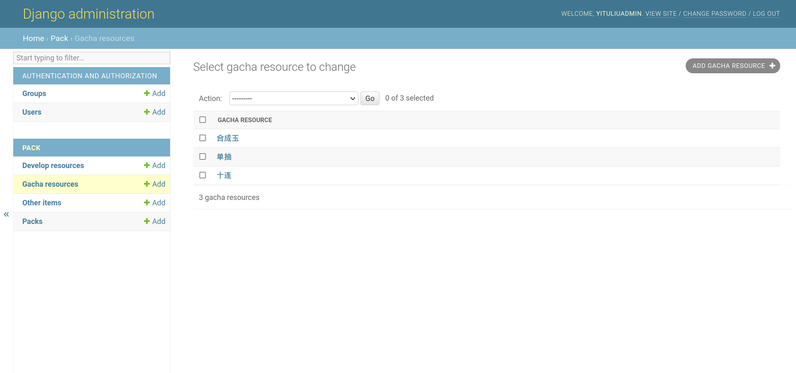

点击右上角的 ADD GACHA RESOURCE 按钮，可以添加新的养成资源。点击列表中的一项，可以查看和编辑名称与对应的合成玉数量。

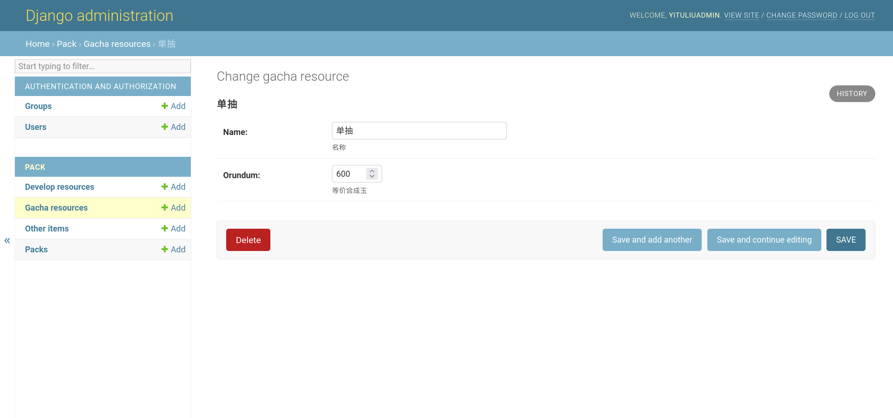

点击右下角的 SAVE 按钮以保存修改。

养成资源包含了 Django Admin 提供的最基本的功能，对应代码为：

```python
@admin.register(GachaResource)
class GachaAdmin(admin.ModelAdmin):
    pass
```

#### Other items

此部分对应的代码为：

```python
@admin.register(OtherItem)
class OtherAdmin(admin.ModelAdmin):
    list_display = ["name", "originium"]
```

与抽卡资源相比，多了 `list_display` 一行，它的作用是，在其它物品的列表页面，除物品名称以外，还能看到这个物品对应的源石数量。

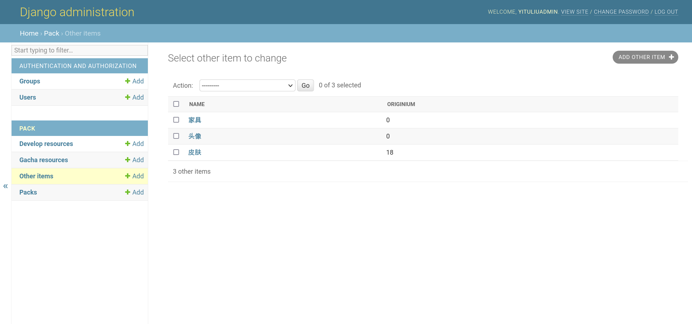

#### Develop resources

与前两类相比，养成资源的代码较为复杂：

```python
@admin.register(DevelopResource)
class DevelopAdmin(DjangoObjectActions, admin.ModelAdmin):
    ordering = ["pinyin"]
    search_fields = ["name"]
    fields = ("name", "value")
    changelist_actions = ("update_value",)
    list_display = ["name", "value", "in_pack"]

    def save_model(self, request, obj, form, change):
        if not obj.pinyin:
            obj.pinyin = "".join(lazy_pinyin(obj.name))
        super().save_model(request, obj, form, change)

    @action(label="更新等效理智")
    def update_value(modeladmin, request, queryset):
        r = requests.get(
            "https://backend.yituliu.site/api/find/item/value/",
            params={"expCoefficient": 0.625},
        )
        data = r.json()["data"]
        qs = DevelopResource.objects.all()
        for i in data:
            name = i["itemName"]
            qs.update_or_create(
                name=name,
                defaults={
                    "pinyin": "".join(lazy_pinyin(name)),
                    "value": i["itemValue"] * 0.8,  # 在绿票价值与理智价值之间换算
                },
            )

    @admin.display(description="礼包")
    def in_pack(self, obj):
        pack_list = [f"{p.pack.name}" for p in obj.developlist_set.all()]
        if (length := len(pack_list)) > 2:
            return f"{pack_list[0]}, {pack_list[1]} 等（共{length}个）"
        else:
            return ", ".join(pack_list)
```

养成资源内容较多，为了提高效率、减少出错，将养成资源按名称的汉语拼音进行排序，并允许搜索名称：

```python
ordering = ["pinyin"]
search_fields = ["name"]
```

使用 [pypinyin](https://github.com/mozillazg/python-pinyin)，在保存修改时添加拼音：

```python
def save_model(self, request, obj, form, change):
    if not obj.pinyin:
        obj.pinyin = "".join(lazy_pinyin(obj.name))
    super().save_model(request, obj, form, change)
```

在编辑单个养成资源时，只显示名称与对应的理智价值，隐藏拼音的值：

```python
fields = ("name", "value")
```

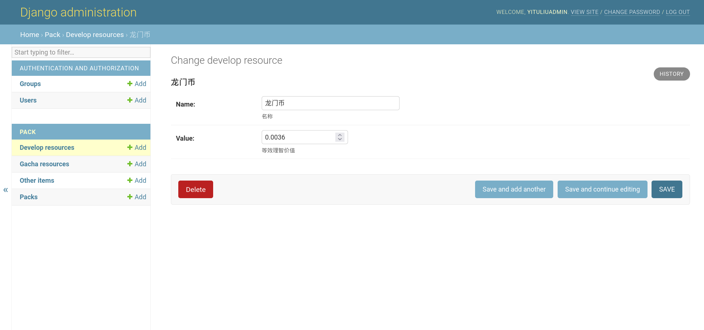

每种资源对应的理智价值也在不断变化。使用 [django-object-actions](https://github.com/crccheck/django-object-actions/)，在养成资源列表页面的右上角，添加了“更新等效理智”按钮，点击即可从一图流的后端下载所有物品的绿票价值，转换（乘以 0.8）后保存。

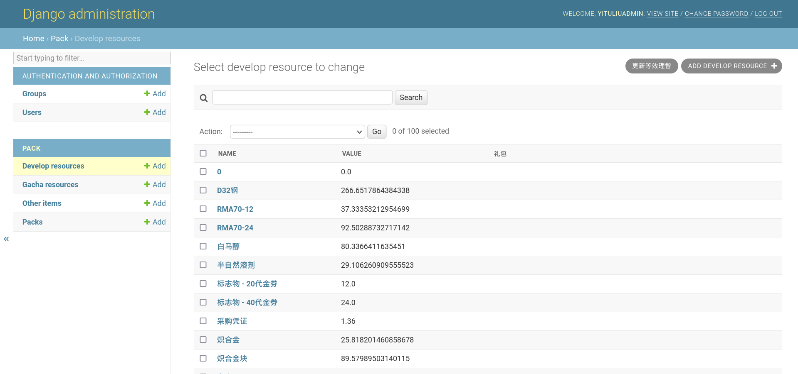

```python
@action(label="更新等效理智")
def update_value(modeladmin, request, queryset):
    r = requests.get(
        "https://backend.yituliu.site/api/find/item/value/",
        params={"expCoefficient": 0.625},
    )
    data = r.json()["data"]
    qs = DevelopResource.objects.all()
    for i in data:
        name = i["itemName"]
        qs.update_or_create(
            name=name,
            defaults={
                "pinyin": "".join(lazy_pinyin(name)),
                "value": i["itemValue"] * 0.8,  # 在绿票价值与理智价值之间换算
            },
        )
```

为了录入礼包数据方便，保留了所有下载的物品。那么如何知道某一项养成资源包含在哪些礼包中呢？在养成资源列表页面，添加了“礼包”一列：

```python
@admin.display(description="礼包")
def in_pack(self, obj):
    pack_list = [f"{p.pack.name}" for p in obj.developlist_set.all()]
    if (length := len(pack_list)) > 2:
        return f"{pack_list[0]}, {pack_list[1]} 等（共{length}个）"
    else:
        return ", ".join(pack_list)
```

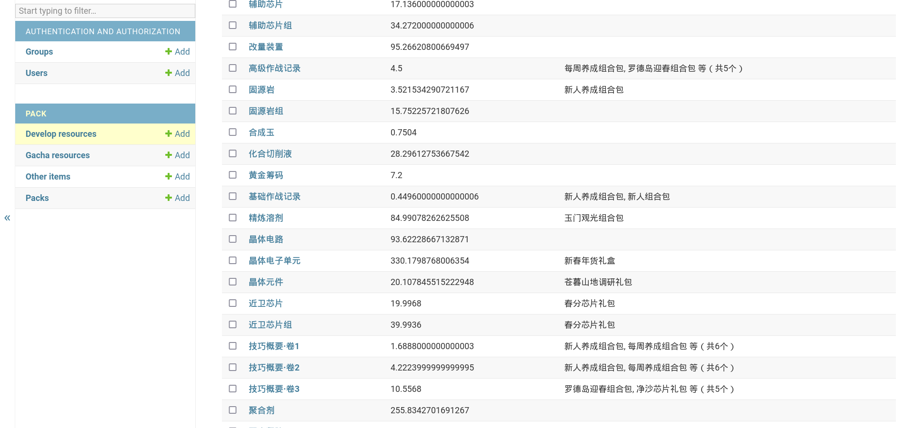

礼包数量较多时，仅显示两个礼包。

#### Packs

礼包最为复杂。对应代码如下：

```python
@admin.register(Pack)
class PackAdmin(admin.ModelAdmin):
    fields = (
        ("name", "pack_id"),
        "display_name",
        "image",
        "limitation",
        ("price", "on_sale"),
        "originium",
        "note",
    )
    radio_fields = {"limitation": admin.HORIZONTAL}
    inlines = [GachaInline, DevelopInline, OtherInline]
    list_display = [
        "name",
        "pack_id",
        "limitation",
        "price",
        "originium",
        "on_sale",
        "note",
    ]
```

在礼包详情页面，可以修改礼包的大部分信息。礼包的购买限制，使用单选组件。

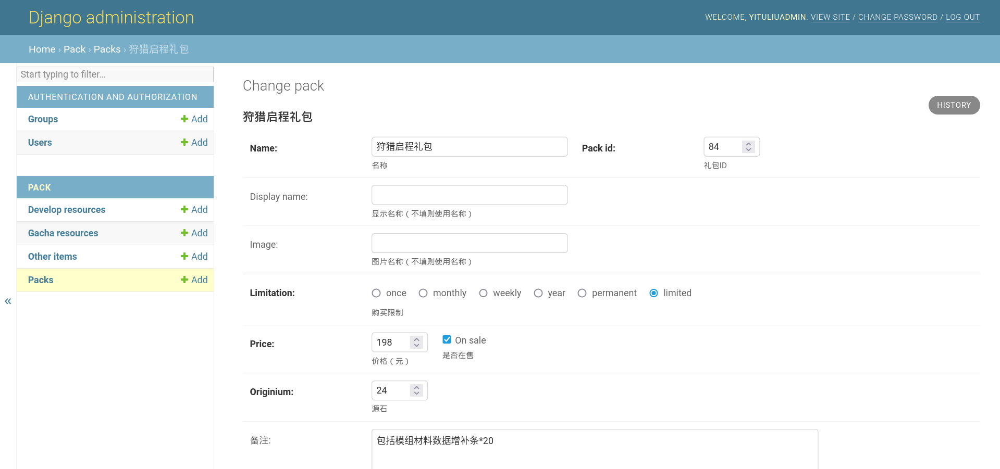

```python
fields = (
    ("name", "pack_id"),
    "display_name",
    "image",
    "limitation",
    ("price", "on_sale"),
    "originium",
    "note",
)
radio_fields = {"limitation": admin.HORIZONTAL}
```

为方便添加与修改礼包中的内容及数量，在下方还在行内显示三种内容。首先定义三个 Inline Admin。在 DevelopInline 中指定了 autocomplete_fields，因此可以在添加养成资源时，在下拉列表中通过名称搜索。

```python
class GachaInline(admin.TabularInline):
    model = GachaList
    extra = 3


class DevelopInline(admin.TabularInline):
    model = DevelopList
    extra = 5
    autocomplete_fields = ["develop_resource"]


class OtherInline(admin.TabularInline):
    model = OtherList
    extra = 0
```

随后添加 inlines：

```python
inlines = [GachaInline, DevelopInline, OtherInline]
```

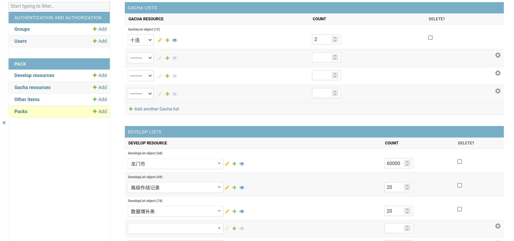

如果要添加数据库中没有的资源，可以直接在空白的一列点击绿色的加号，在弹出的窗口中编辑。

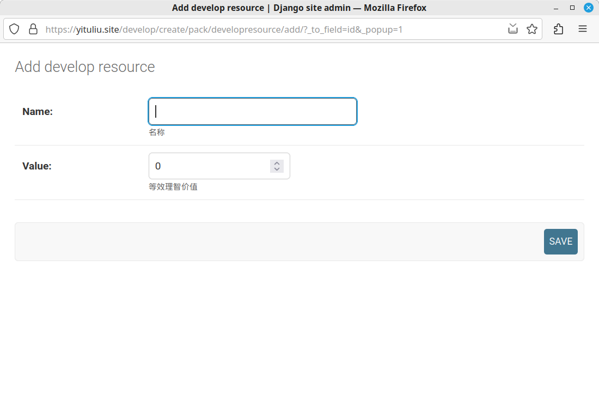

保存后，即可在那一列的下拉列表中选择刚刚添加的内容。

在礼包的列表页面，展示了礼包的一些属性。

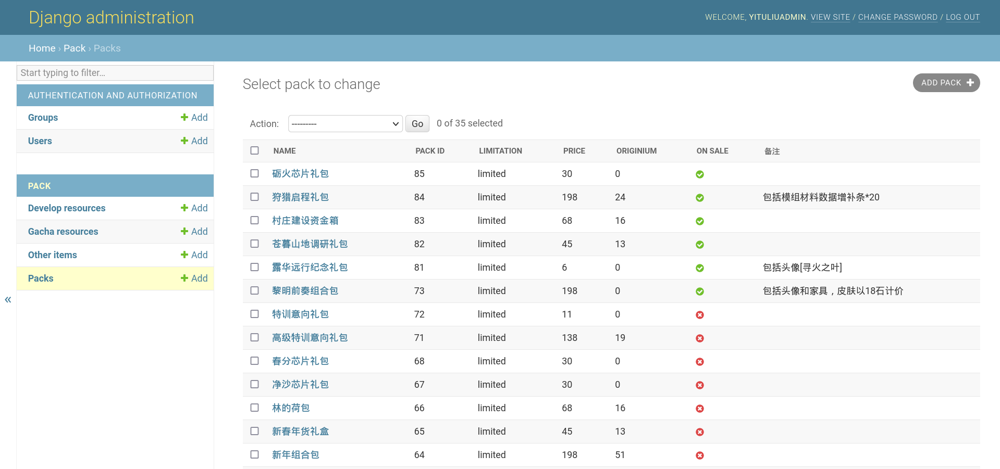

```python
list_display = [
    "name",
    "pack_id",
    "limitation",
    "price",
    "originium",
    "on_sale",
    "note",
]
```
